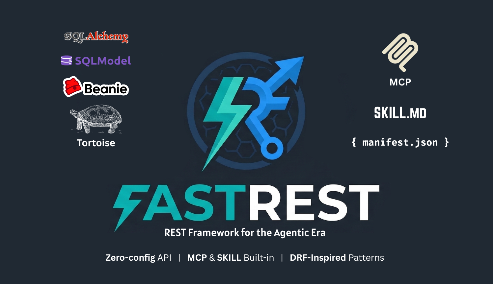

<p align="center">
  
</p>

<p align="center">
  <a href="https://github.com/hoaxnerd/fastrest/actions/workflows/ci.yml"></a>
  <a href="https://pypi.org/project/fastrest/"></a>
  <a href="https://pypi.org/project/fastrest/"></a>
  <a href="https://github.com/hoaxnerd/fastrest/blob/main/LICENSE"></a>
</p>

# FastREST

**DRF inspired REST Framework for FastAPI.**

FastREST lets you build async REST APIs using the patterns you already know from DRF — serializers, viewsets, routers, permissions — running on FastAPI with Pydantic validation and auto-generated OpenAPI docs.

```
pip install fastrest
pip install fastrest[sqlalchemy]
pip install fastrest[mcp]
pip install fastrest[sqlalchemy,mcp]
```

> **Status:** Beta (0.1.2). The core API is stable for serializers, viewsets, routers, pagination, filtering, authentication, throttling, content negotiation, and agent integration (Skills & MCP).

---

## Why FastREST?

If you've used Django REST Framework, you know how productive it is. But DRF is synchronous and tied to Django's ORM. FastREST gives you the same developer experience on a modern async stack:

| | DRF | FastREST |
|---|---|---|
| **Framework** | Django | FastAPI |
| **ORM** | Django ORM | SQLAlchemy (async) |
| **Validation** | DRF fields | DRF fields + Pydantic |
| **Async** | No | Native async/await |
| **OpenAPI** | Via drf-spectacular | Built-in (per-method routes) |
| **Type hints** | Optional | First-class |

## Quick Start

### 1. Define your model (SQLAlchemy)

```python
from sqlalchemy import Column, Integer, String, Boolean
from sqlalchemy.orm import DeclarativeBase

class Base(DeclarativeBase):
    pass

class Author(Base):
    __tablename__ = "authors"
    id = Column(Integer, primary_key=True, autoincrement=True)
    name = Column(String(200), nullable=False)
    bio = Column(String(1000))
    is_active = Column(Boolean, default=True)
```

### 2. Define your serializer

```python
from fastrest.serializers import ModelSerializer

class AuthorSerializer(ModelSerializer):
    class Meta:
        model = Author
        fields = ["id", "name", "bio", "is_active"]
        read_only_fields = ["id"]
```

### 3. Define your viewset

```python
from fastrest.viewsets import ModelViewSet

class AuthorViewSet(ModelViewSet):
    queryset = Author
    serializer_class = AuthorSerializer
```

### 4. Register routes and create the app

```python
from fastapi import FastAPI
from fastrest.routers import DefaultRouter

router = DefaultRouter()
router.register("authors", AuthorViewSet, basename="author")

app = FastAPI(title="My API")
app.include_router(router.urls, prefix="/api")
```

That's it. You now have:

- `GET /api/authors` — List all authors
- `POST /api/authors` — Create an author (201)
- `GET /api/authors/{pk}` — Retrieve an author
- `PUT /api/authors/{pk}` — Update an author
- `PATCH /api/authors/{pk}` — Partial update
- `DELETE /api/authors/{pk}` — Delete an author (204)
- `GET /api/` — API root listing all resources
- `GET /docs` — Interactive Swagger UI with typed schemas
- `GET /redoc` — ReDoc documentation

---

## Features

### Serializers

ModelSerializer auto-generates fields from your SQLAlchemy model, just like DRF:

```python
from fastrest.serializers import ModelSerializer
from fastrest.fields import FloatField
from fastrest.exceptions import ValidationError

class BookSerializer(ModelSerializer):
    # Override auto-generated fields
    price = FloatField(min_value=0.01)

    class Meta:
        model = Book
        fields = ["id", "title", "isbn", "price", "author_id"]
        read_only_fields = ["id"]

    # Per-field validation hooks
    def validate_isbn(self, value):
        if value and len(value) not in (10, 13):
            raise ValidationError("ISBN must be 10 or 13 characters.")
        return value
```

**Supported fields:** CharField, IntegerField, FloatField, BooleanField, DecimalField, DateTimeField, DateField, TimeField, UUIDField, EmailField, URLField, SlugField, ListField, DictField, JSONField, SerializerMethodField, and more.

### ViewSets

```python
from fastrest.viewsets import ModelViewSet, ReadOnlyModelViewSet

class BookViewSet(ModelViewSet):
    queryset = Book
    serializer_class = BookSerializer

    # Switch serializer based on action
    def get_serializer_class(self):
        if self.action == "retrieve":
            return BookDetailSerializer
        return BookSerializer
```

### Custom Actions

Add custom endpoints to viewsets with the `@action` decorator:

```python
from fastrest.decorators import action
from fastrest.response import Response

class BookViewSet(ModelViewSet):
    queryset = Book
    serializer_class = BookSerializer

    @action(methods=["get"], detail=False, url_path="in-stock")
    async def in_stock(self, request, **kwargs):
        """GET /api/books/in-stock — List only in-stock books."""
        books = await self.adapter.filter_queryset(
            Book, self.get_session(), in_stock=True
        )
        serializer = self.get_serializer(books, many=True)
        return Response(data=serializer.data)

    @action(methods=["post"], detail=True, url_path="toggle-stock")
    async def toggle_stock(self, request, **kwargs):
        """POST /api/books/{pk}/toggle-stock — Toggle in_stock flag."""
        book = await self.get_object()
        session = self.get_session()
        await self.adapter.update(book, session, in_stock=not book.in_stock)
        serializer = self.get_serializer(book)
        return Response(data=serializer.data)
```

### Pagination

Add pagination to any viewset:

```python
from fastrest.pagination import PageNumberPagination

class BookPagination(PageNumberPagination):
    page_size = 20
    max_page_size = 100

class BookViewSet(ModelViewSet):
    queryset = Book
    serializer_class = BookSerializer
    pagination_class = BookPagination
```

Paginated list responses return an envelope:

```json
{
  "count": 42,
  "next": "?page=2&page_size=20",
  "previous": null,
  "results": [...]
}
```

Also available: `LimitOffsetPagination` with `?limit=20&offset=0`.

### Filtering & Search

Add search and ordering with filter backends:

```python
from fastrest.filters import SearchFilter, OrderingFilter

class BookViewSet(ModelViewSet):
    queryset = Book
    serializer_class = BookSerializer
    pagination_class = BookPagination
    filter_backends = [SearchFilter, OrderingFilter]
    search_fields = ["title", "description", "isbn"]
    ordering_fields = ["title", "price"]
    ordering = ["title"]  # default ordering
```

- `GET /api/books?search=django` — case-insensitive search across `search_fields`
- `GET /api/books?ordering=-price` — sort by price descending
- `GET /api/books?ordering=title,price` — multi-field sort
- All query parameters appear automatically in OpenAPI `/docs`

### Permissions

Composable permission classes with `&`, `|`, `~` operators:

```python
from fastrest.permissions import BasePermission, IsAuthenticated

class IsOwner(BasePermission):
    def has_object_permission(self, request, view, obj):
        return obj.owner_id == request.user.id

class ArticleViewSet(ModelViewSet):
    queryset = Article
    serializer_class = ArticleSerializer
    permission_classes = [IsAuthenticated & IsOwner]
```

Built-in: `AllowAny`, `IsAuthenticated`, `IsAdminUser`, `IsAuthenticatedOrReadOnly`.

### Authentication

Pluggable authentication backends, just like DRF:

```python
from fastrest.authentication import TokenAuthentication

# Provide a lookup function that returns a user or None
def get_user_by_token(token_key):
    return User.objects.get(token=token_key)  # your lookup logic

token_auth = TokenAuthentication(get_user_by_token=get_user_by_token)

class ArticleViewSet(ModelViewSet):
    queryset = Article
    serializer_class = ArticleSerializer
    authentication_classes = [token_auth]
    permission_classes = [IsAuthenticated]
```

Built-in backends:

- **`TokenAuthentication`** — `Authorization: Token <key>` (or `Bearer` with `keyword="Bearer"`)
- **`BasicAuthentication`** — HTTP Basic with a `get_user_by_credentials(username, password)` callback
- **`SessionAuthentication`** — Session-based with a `get_user_from_session(request)` callback

Unauthenticated requests to views with authentication backends return **401** (not 403).

### Throttling

Rate-limit requests with throttle backends:

```python
from fastrest.throttling import SimpleRateThrottle

class BurstRateThrottle(SimpleRateThrottle):
    rate = "60/min"

    def get_cache_key(self, request, view):
        return f"burst_{self.get_ident(request)}"

class ArticleViewSet(ModelViewSet):
    queryset = Article
    serializer_class = ArticleSerializer
    throttle_classes = [BurstRateThrottle]
```

Built-in throttles:

- **`AnonRateThrottle`** — Throttle unauthenticated requests by IP
- **`UserRateThrottle`** — Throttle authenticated requests by user ID, anonymous by IP

Rate strings: `"100/hour"`, `"10/min"`, `"1000/day"`, `"5/sec"`.

Throttled responses return **429** with a `Retry-After` header.

### App Configuration

Bind settings per-app, just like Django's `settings.py`:

```python
from fastrest.settings import configure

app = FastAPI()
configure(app, {
    "DEFAULT_PAGINATION_CLASS": "fastrest.pagination.PageNumberPagination",
    "PAGE_SIZE": 20,
    "DEFAULT_PERMISSION_CLASSES": ["fastrest.permissions.IsAuthenticated"],
    "DEFAULT_AUTHENTICATION_CLASSES": [token_auth],
    "SKILL_NAME": "my-api",
    "MCP_PREFIX": "/mcp",
})
```

Settings resolve in order: **viewset attribute → app config → framework default**. Unknown keys raise `ValueError` by default (set `STRICT_SETTINGS=False` to allow).

### Auth Scopes

Permission class for scope-based access control:

```python
from fastrest.permissions import HasScope, IsAuthenticated

class ArticleViewSet(ModelViewSet):
    queryset = Article
    serializer_class = ArticleSerializer
    permission_classes = [IsAuthenticated & HasScope("articles:read")]
```

Scopes are read from `request.auth.scopes` (a list of strings set by your authentication backend).

### Agent Integration (Skills & MCP)

FastREST auto-generates agent-compatible interfaces from your viewsets — no extra code needed.

**SKILL.md** — Machine-readable API documentation for AI agents:

```python
# Auto-served at GET /SKILL.md and GET /{resource}/SKILL.md
# Includes: fields, endpoints, auth requirements, query parameters, examples
# Customize per-viewset:
class BookViewSet(ModelViewSet):
    skill_description = "Manage the book catalog"
    skill_exclude_actions = ["destroy"]
    skill_examples = [{"description": "Search books", "request": "GET /books?search=python", "response": "200"}]
```

**MCP Server** — Built-in Model Context Protocol server:

```python
from fastrest.mcp import mount_mcp

# One line to add MCP tools for all your viewsets
mount_mcp(app, router)
# Tools are auto-generated: books_list, books_create, books_retrieve, etc.
# Auth, permissions, and throttling all apply to MCP tool calls
```

**API Manifest** — Structured JSON metadata at `GET /manifest.json`:

```json
{
  "version": "1.0",
  "name": "my-api",
  "resources": [{"name": "books", "prefix": "books", "actions": [...], "fields": [...]}],
  "mcp": {"enabled": true, "prefix": "/mcp"},
  "skills": {"enabled": true, "endpoint": "/SKILL.md"}
}
```

### Content Negotiation

Select response format based on the `Accept` header:

```python
from fastrest.negotiation import DefaultContentNegotiation, JSONRenderer, BrowsableAPIRenderer

# Renderers and negotiation are available for custom use
negotiation = DefaultContentNegotiation()
renderer, media_type = negotiation.select_renderer(request, [JSONRenderer(), BrowsableAPIRenderer()])
```

### Routers

```python
from fastrest.routers import DefaultRouter, SimpleRouter

# DefaultRouter adds an API root view at /
router = DefaultRouter()
router.register("authors", AuthorViewSet, basename="author")
router.register("books", BookViewSet, basename="book")

# SimpleRouter without the root view
router = SimpleRouter()
```

Each HTTP method gets its own OpenAPI route with:
- Correct status codes (201 for create, 204 for delete)
- Typed `pk: int` path parameters
- Request/response Pydantic schemas auto-generated from serializers
- Tag-based grouping by resource
- Unique operation IDs

### Validation

Three levels of validation, same as DRF:

```python
class ReviewSerializer(ModelSerializer):
    class Meta:
        model = Review
        fields = ["id", "book_id", "reviewer_name", "rating", "comment"]

    # 1. Field-level: validate_{field_name}
    def validate_rating(self, value):
        if not (1 <= value <= 5):
            raise ValidationError("Rating must be between 1 and 5.")
        return value

    # 2. Object-level: validate()
    def validate(self, attrs):
        if attrs.get("rating", 0) < 3 and not attrs.get("comment"):
            raise ValidationError("Low ratings require a comment.")
        return attrs

    # 3. Field constraints via field kwargs
    # e.g., CharField(max_length=500), IntegerField(min_value=1)
```

### Testing

Built-in async test client:

```python
import pytest
from fastrest.test import APIClient

@pytest.fixture
def client(app):
    return APIClient(app)

@pytest.mark.asyncio
async def test_create_author(client):
    resp = await client.post("/api/authors", json={
        "name": "Ursula K. Le Guin",
        "bio": "Science fiction author",
    })
    assert resp.status_code == 201
    assert resp.json()["name"] == "Ursula K. Le Guin"

@pytest.mark.asyncio
async def test_list_authors(client):
    resp = await client.get("/api/authors")
    assert resp.status_code == 200
    assert isinstance(resp.json(), list)
```

### Generic Views

For when you don't need the full viewset:

```python
from fastrest.generics import (
    ListCreateAPIView,
    RetrieveUpdateDestroyAPIView,
)

class AuthorList(ListCreateAPIView):
    queryset = Author
    serializer_class = AuthorSerializer

class AuthorDetail(RetrieveUpdateDestroyAPIView):
    queryset = Author
    serializer_class = AuthorSerializer
```

Available: `CreateAPIView`, `ListAPIView`, `RetrieveAPIView`, `DestroyAPIView`, `UpdateAPIView`, `ListCreateAPIView`, `RetrieveUpdateAPIView`, `RetrieveDestroyAPIView`, `RetrieveUpdateDestroyAPIView`.

---

## Full Example

See the [fastrest-example](https://github.com/hoaxnerd/fastrest-example) repo for a complete bookstore API with authors, books, tags, and reviews.

---

## DRF Compatibility

FastREST implements the core DRF public API. If you've used DRF, you already know FastREST:

| DRF | FastREST | Status |
|---|---|---|
| `ModelSerializer` | `ModelSerializer` | Done |
| `ModelViewSet` | `ModelViewSet` | Done |
| `ReadOnlyModelViewSet` | `ReadOnlyModelViewSet` | Done |
| `DefaultRouter` | `DefaultRouter` | Done |
| `@action` | `@action` | Done |
| `permission_classes` | `permission_classes` | Done |
| `ValidationError` | `ValidationError` | Done |
| Field library | Field library | Done |
| `APIClient` (test) | `APIClient` (test) | Done |
| Pagination | `PageNumberPagination`, `LimitOffsetPagination` | Done |
| Filtering/Search | `SearchFilter`, `OrderingFilter` | Done |
| Authentication backends | `TokenAuthentication`, `BasicAuthentication`, `SessionAuthentication` | Done |
| Throttling | `SimpleRateThrottle`, `AnonRateThrottle`, `UserRateThrottle` | Done |
| Content negotiation | `DefaultContentNegotiation`, `JSONRenderer`, `BrowsableAPIRenderer` | Done |
| App configuration | `configure(app, settings)`, `get_settings(request)` | Done |
| Auth scopes | `HasScope` permission class | Done |
| Agent Skills (SKILL.md) | Auto-generated from viewsets/serializers | Done |
| MCP Server | Built-in MCP tools from viewsets | Done |
| API Manifest | `GET /manifest.json` | Done |

---

## Installation

```bash
# Core + SQLAlchemy (most common)
pip install fastrest[sqlalchemy]

# With MCP server support
pip install fastrest[sqlalchemy,mcp]

# Core only (bring your own ORM adapter)
pip install fastrest
```

## Requirements

- Python 3.10+
- FastAPI 0.100+
- Pydantic 2.0+
- SQLAlchemy 2.0+ (async) — via `fastrest[sqlalchemy]`

## License

BSD 3-Clause. See [LICENSE](LICENSE).
